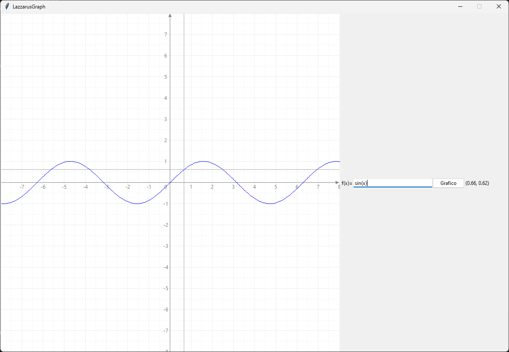

# LazzarusGraph

Small utility for graphing mathematical functions developed using tkinter.

This utility is not finished yet and it's not meant for professional use.

## Running

To run the program you have two possibilities:

1. First option: 
    ```shell
    $ python main.py
    ```
    This command will just start LazzarusGraph with an empty graph
2. Second option:
    ```shell
    $ python main.py "function"
    ```
    This command will start LazzarusGraph with the function 
    passed as an argument already graphed. For example if the 
    argument `"sin(x)"` is passed, the program will start like the
    screenshot in the [gallery](#gallery) section.

## Builds
In the [dist](/dist/) folder it is possibile to find a Windows
executable of the program built using [pyinstaller](https://pyinstaller.org/en/stable/).

## Gallery

